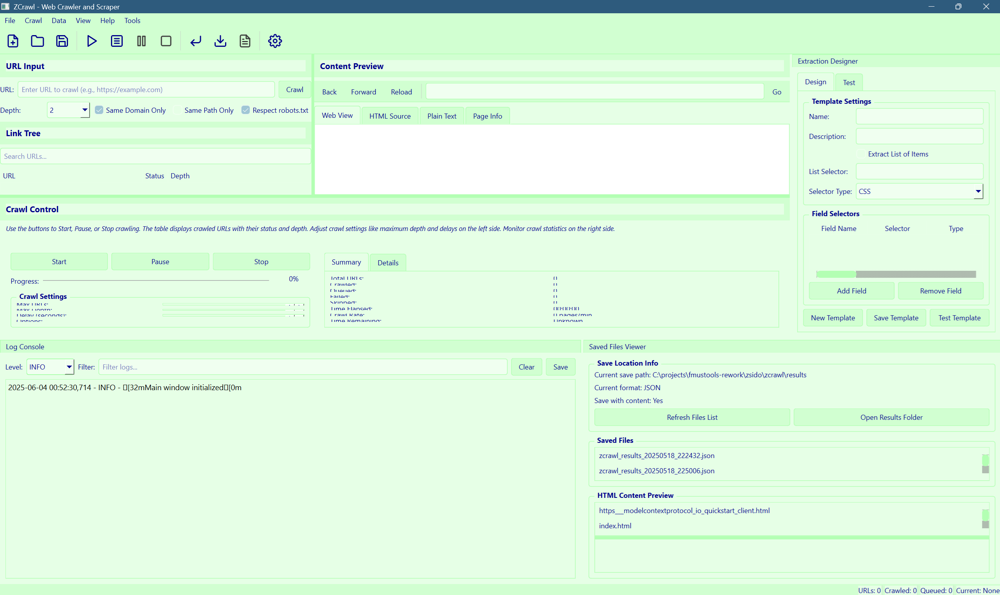

# ZCrawl



ZCrawl is an advanced web crawling and scraping desktop application. It provides a interface for crawling websites, extracting data, and saving results in various formats.

## Features

- **Interactive Web Crawling**: Crawl websites with configurable depth and domain restrictions
- **Content Preview**: View crawled pages directly in the application
- **Link Tree Visualization**: See the structure of crawled websites
- **Data Extraction**: Extract specific data from crawled pages
- **Multiple Export Formats**: Save results in JSON, CSV, HTML, or XML formats
- **Project Management**: Save and load crawling projects
- **Customizable Settings**: Configure crawling behavior, saving options, and more
- **Modern UI**: Clean, modern interface with light green and dark blue theme

## Installation

### Prerequisites

- Python 3.9 or higher
- PyQt6
- Other dependencies listed in `pyproject.toml`

### From Source

1. Clone the repository:
   ```bash
   git clone https://github.com/mexyusef/zcrawl.git
   cd zcrawl
   ```

2. Install dependencies:
   ```bash
   pip install -e .
   ```

3. Run the application:
   ```bash
   # On Windows
   run.bat

   # On Linux/macOS
   ./run.sh
   ```

## Usage

1. **Enter a URL**: Type a URL in the input field
2. **Configure Crawl Options**: Set depth, domain restrictions, etc.
3. **Start Crawling**: Click the "Start Crawl" button
4. **Explore Results**: View crawled pages in the link tree
5. **Extract Data**: Use the extraction designer to extract specific data
6. **Save Results**: Save crawl results in your preferred format

## Development

### Project Structure

```
zcrawl/
├── zcrawl/
│   ├── __init__.py
│   ├── __main__.py
│   ├── core/
│   ├── crawlers/
│   ├── extractors/
│   ├── models/
│   ├── resources/
│   │   ├── icons/
│   │   └── stylesheet.py
│   ├── ui/
│   └── utils/
├── tests/
├── pyproject.toml
├── LICENSE
├── README.md
├── run.bat
└── run.sh
```

### Running Tests

```bash
pytest
```

### Contributing

Contributions are welcome! Please feel free to submit a Pull Request.

1. Fork the repository
2. Create your feature branch (`git checkout -b feature/amazing-feature`)
3. Commit your changes (`git commit -m 'Add some amazing feature'`)
4. Push to the branch (`git push origin feature/amazing-feature`)
5. Open a Pull Request

## License

This project is licensed under the MIT License - see the [LICENSE](LICENSE) file for details.
